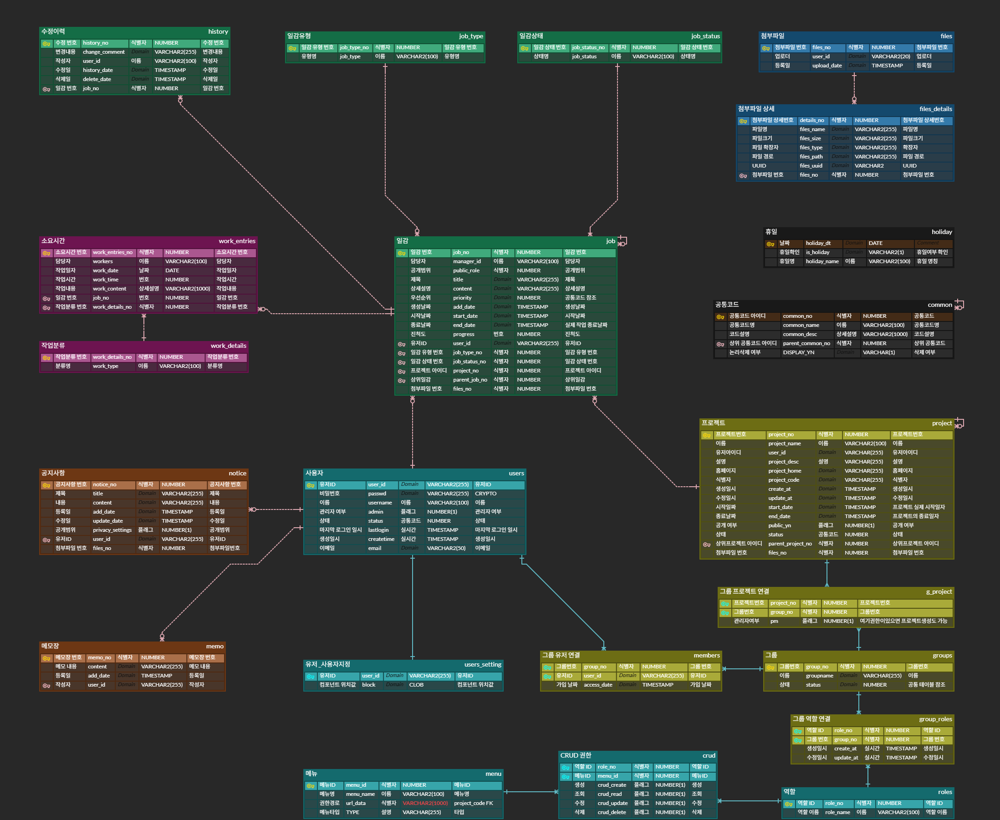
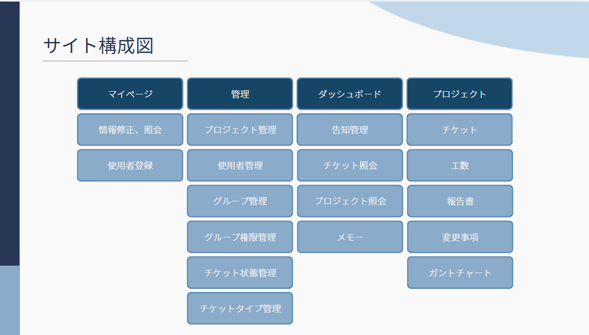

# ProjectFlow（プロジェクト管理プログラム）

## 📋 プロジェクト概要

既存のプロジェクト管理ツール「Redmine」は、多くの開発現場でタスク管理に活用されてきました。

しかし、設定の複雑さや不自然な翻訳による韓国語表記などが原因で、
ユーザーがRedmineに慣れるまでにかなりの時間を要するという問題点がありました。

私たちは、UI/UXを直感的に改善することを目指し、組織に合わせてプロジェクトを統合管理できるシステムの構築に挑戦しました。

特に、各プロジェクトの運営に必要な設定を、管理者画面で一括管理できる点に重点を置いて開発を進めました。

---

## 🛠️ 環境

| 区分 | 使用技術 |
|------|----------|
| 分析・設計 | Figma, ERD Cloud, Google Workspace |
| IDE | Eclipse |
| ソースコード管理 | GitHub |
| データベース | Oracle |
| デプロイ | Jenkins, Docker, AWS |
| フロントエンド | HTML, CSS, JavaScript, jQuery, Thymeleaf, CoreUI, DHTMLX |
| バックエンド | Spring Boot, Java, Mybatis, JPA |

---

## 📊 ERD図

> 総テーブル数：22個
---

## 🗺️ サイト構成図

---

## 👥 チーム役割

> ※ 個人情報保護のため、一部メンバーはイニシャルで表記しています。

| メンバー     | 担当内容 |
|----------|----------|
| **キム・ドンウ** | **GitHub Branch 管理／チケット／工数／報告書** |
| BJ | チームリーダー／デプロイ／ダッシュボード／管理者 |
| KH | サブリーダー／開発環境を構築／プロジェクト管理／ガントチャート |
| SS | DBクラウドサーバー構築・管理／保安／共用API／ログイン／会員登録／マイページ |

---

## 🎬 実演動画

**YouTubeリンク:** [ProjectFlow](https://youtu.be/LfKW6Law_SE)

---

## 📁 担当機能のディレクトリ

